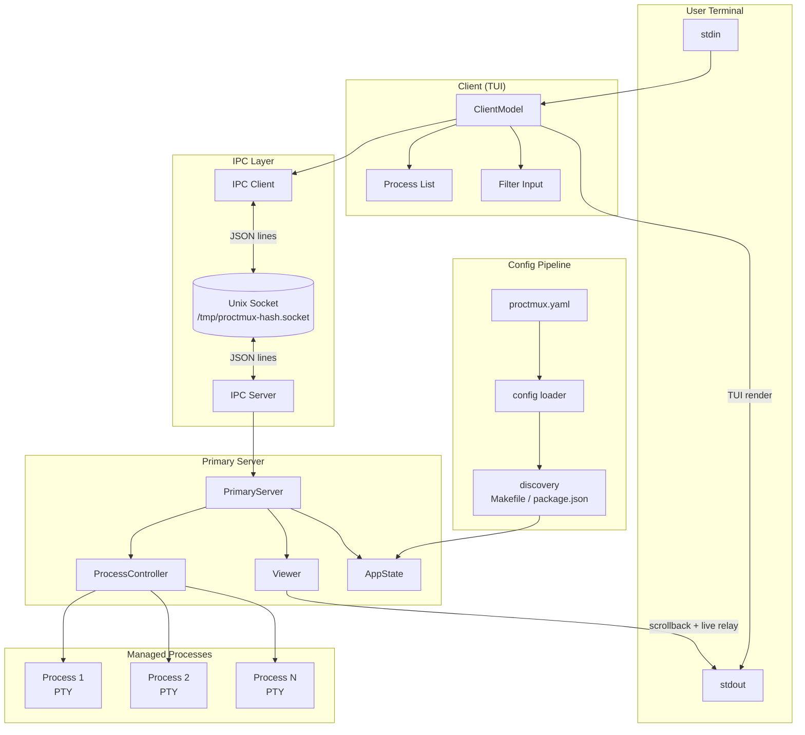

# Architecture

proctmux is a terminal-based process manager built on a **client-server architecture** that communicates over Unix domain sockets. A single primary server owns all process state and lifecycle, while one or more clients connect via IPC to display the interactive TUI and send commands. This separation allows multiple views of the same process set, and enables different runtime modes that compose the same components in different ways.

## Component Diagram



## Zig Module Map

The Zig runtime keeps the CLI entrypoint thin and pushes runtime ownership into
domain modules:

| Module | Purpose |
|--------|---------|
| `src/app/` | App entrypoints, CLI parsing/routing, exit-code behavior, raw terminal entry/restore |
| `src/modes/` | Primary, client, and signal runtime modes plus shared production input/output adapters |
| `src/config/runtime.zig` | Loads Project Config and applies discovery in one place |
| `src/terminal/` | Raw terminal mode management, terminal size probing, and the narrow `ghostty_vt` wrapper |
| `src/unified/` | Unified runtime loop, child-primary PTY adapter, in-process test adapter, split rendering, and server-pane output state |
| `src/ipc/line.zig` | JSON-line reading, timeout reads, and message-kind detection |
| `src/ipc/command_codec.zig` | Command request and response wire encoding/parsing |
| `src/ipc/state_codec.zig` | State broadcast wire encoding/parsing |
| `src/ipc/protocol.zig` | Compatibility export layer for existing callers |
| `src/proc/` | Process controller plus focused internals for environment, spawn/wait, output capture, and `on_kill` |
| `src/test_support/` | Shared fake adapters and fixtures used by Zig tests |

## Mode Variants

proctmux supports three runtime modes, each composing the same core components differently. See [modes.md](modes.md) for full details.

| Mode | How it runs | Components in play |
|------|------------|-------------------|
| **Primary** (`proctmux`) | Standalone server with viewer | `modes.primary` + Primary Server + IPC Server |
| **Client** (`proctmux --client`) | TUI connects to running primary | `modes.client` + Client Session + IPC Client |
| **Unified** (`proctmux --unified`) | Embedded server process + client TUI in one split model | `unified.runtime` + split model + `server_output` + `terminal.ghostty_vt` |

## Data Flow: Config to Screen

```
proctmux.yaml
    |
    v
config.runtime.loadInDir()   -- src/config/runtime.zig
    |
    v
discover.apply               -- src/discover/
    |                           (merges Makefile / package.json entries)
    v
ProcTmuxConfig.Procs         -- map[string]ProcessConfig
    |
    v
domain.AppState.init()       -- src/domain/state.zig
    |                           (creates Process list with sequential IDs)
    v
Primary Server               -- src/primary/
    |
    v
IPC Server broadcast         -- src/ipc/server.zig
    |                           (calls redact.StateForIPC to strip env vars)
    v
IPC Client read              -- src/ipc/client.zig
    |                           (pushes StateUpdate onto buffered channel)
    v
Client Session / Model       -- src/tui/
    |                           (processes clientStateUpdateMsg)
    v
TUI renderer                 -- src/tui/render.zig
    |                           (renders process list text and ANSI styles)
    v
Terminal output
```

## Data Flow: Process Output

Each managed process runs inside a PTY. Output flows through a ring buffer to the viewer (primary mode) or to unified-mode server-pane state. IPC state broadcasts carry process status and scrollback snapshots for clients; raw VT interpretation for the unified server pane is delegated to vendored `libghostty-vt` through `src/terminal/ghostty_vt.zig`.

```
Process stdout/stderr
    |
    v
PTY slave --> PTY master     -- src/proc/spawn.zig
    |
    v
output capture to RingBuffer -- src/proc/output.zig + src/ring/
    |
    +---> Viewer.SwitchToProcess()
    |         |
    |         +---> SnapshotAndSubscribe()
    |         |         |
    |         |         +---> Write snapshot (historical) to stdout
    |         |         +---> Start live relay goroutine
    |         |                   |
    |         |                   v
    |         |               os.Stdout (user's terminal)
    |
    +---> Unified server_output.State
    |         |
    |         +---> terminal.ghostty_vt.Terminal
    |                   |
    |                   v
    |               rendered server-pane text
    |
    +---> BroadcastState()
              |
              v
          IPC clients (status + bounded scrollback snapshots)
```

## Data Flow: User Input

```
Keystroke
    |
    v
TUI key input                -- src/tui/key_input.zig
    |
    +---> Local UI action (navigate list, filter, toggle help)
    |
    +---> IPC command (start, stop, restart, switch)
              |
              v
          IPC client command
              |
              v
          IPC Server.handleCommand()   -- src/ipc/server.zig
              |
              v
          Primary Server command handler -- src/primary/
              |
              +---> ProcessController.StartProcess()
              +---> ProcessController.StopProcess()
              +---> switchToProcessLocked() (updates viewer + stdin target)
              |
              v
          BroadcastState() to all connected clients
```

## IPC Protocol Summary

proctmux uses a JSON-over-Unix-socket protocol. The socket is created at `/tmp/proctmux-<hash>.socket` where `<hash>` is derived from the config file contents, ensuring distinct sockets per project.

Two message patterns:

- **State broadcasts** (server to all clients): The server pushes a `{"type": "state", ...}` message containing the full `AppState` and computed `ProcessView` list whenever state changes (process start/stop/exit, selection change).
- **Request/response** (client to server): A client sends `{"type": "command", "action": "start", "label": "my-proc", "request_id": "1"}` and receives a `{"type": "response", "request_id": "1", "success": true}`.

See [ipc.md](ipc.md) for the full protocol reference.

## Process Management Model

Responsibilities are split across three layers:

- **`ProcessController`** (`src/proc/controller.zig`) — owns process lifecycle orchestration and delegates environment construction, spawn/wait, output capture, and `on_kill` hooks to focused proc internals.
- **`Primary Server`** (`src/primary/`) — owns application state. Coordinates process commands, updates `AppState`, triggers IPC broadcasts, and tracks the current process for stdin forwarding.
- **`IPC Server`** (`src/ipc/server.zig`) — owns client connections. Accepts clients, authenticates peer UIDs, routes commands to the Primary Server, broadcasts state updates, and uses `ipc.line` plus codec modules for wire IO.

## Security Model

- **Socket file permissions**: The Unix socket is created with mode `0600` (owner-only read/write).
- **Peer UID verification**: On platforms that support it (Linux, macOS), the IPC server verifies that connecting clients have the same UID as the server process using `SO_PEERCRED` / `LOCAL_PEERCRED`. On unsupported platforms, the server logs a warning and relies on file permissions alone.
- **Config redaction**: Before transmitting state over IPC, `src/redact/` strips environment variable values from process configs so that secrets defined in `env:` blocks are not sent to clients.

## Concurrency Model

The Zig runtime uses `std.Thread`, atomics, mutexes, and Unix socket polling:

- **Per-process output capture**: `src/proc/output.zig` reads PTY or pipe output and appends to the process ring buffer.
- **Per-process exit watcher**: `src/proc/spawn.zig` waits for child exit and marks the process instance halted.
- **IPC accept loop**: `src/ipc/server.zig` accepts Unix socket clients and serves command/state traffic.
- **State broadcast**: The IPC server writes state messages to connected clients with a bounded write timeout.
- **Stdin forwarder**: `src/modes/primary.zig` reads stdin and forwards bytes to the currently selected process.
- **Unified render loop**: `src/unified/runtime.zig` polls IPC state, terminal dimensions, and split rendering on one shared path for production and tests.

Shared state is protected with `std.Thread.Mutex` and `std.atomic.Value`. Ring buffer readers use bounded queues with non-blocking sends so slow readers do not block process output capture.

## Config Discovery Pipeline

When `general.procs_from_make_targets` or `general.procs_from_package_json` is enabled, `src/discover/` runs before the primary server starts:

1. Scans the working directory for `Makefile` and/or `package.json`
2. Extracts targets/scripts and creates `ProcessConfig` entries
3. Merges them into `cfg.Procs` — explicit config entries take precedence on name collision

See [discovery.md](discovery.md) for naming conventions and detection details.

## Build and Test Entry Points

The shipped binary is built from the Zig entry point `src/main.zig`.
The runtime:

1. Parses flags and subcommands through `src/cli/`
2. Loads YAML config through `src/config/`
3. Applies process discovery through `src/discover/`
4. Routes to primary, client, unified, or signal-command orchestration in
   `src/app/`

Build and test commands:

```bash
make build                 # build the application at bin/proctmux
make test                  # run unit tests
make test-e2e              # run agent-tui e2e tests
make test-all              # run unit + e2e release gates
```

The Makefile drives the Zig build graph with `zig build`, including the
vendored YAML parser, vendored `libghostty-vt`, and Ghostty's required Unicode
table generation step.

## Technology Stack

| Technology | Usage |
|-----------|-------|
| **Zig 0.15.2** | Shipped implementation language |
| **Zig stdlib** | CLI/runtime orchestration, Unix sockets, process management |
| **zig-yaml** | Vendored YAML parsing dependency |
| **libghostty-vt** | Vendored VT/ANSI terminal state for unified-mode process output |
| **uucode** | Vendored Ghostty Unicode table dependency |
| **forkpty / POSIX APIs** | PTY allocation, terminal sizing, signal handling |
| **agent-tui** | End-to-end terminal UI regression tests |

Vendored Ghostty provenance and local patches are recorded in
`third_party/libghostty-vt/PROCTMUX_VENDOR.md`.
