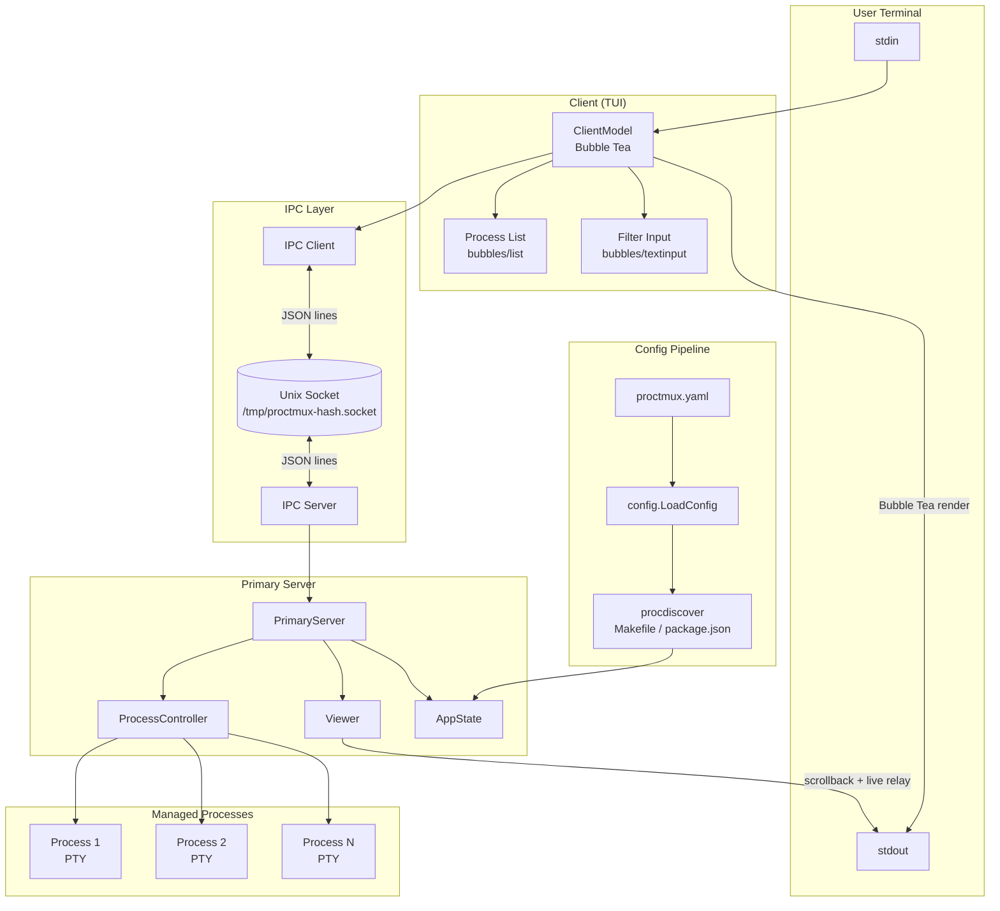

# Architecture

proctmux is a terminal-based process manager built on a **client-server architecture** that communicates over Unix domain sockets. A single primary server owns all process state and lifecycle, while one or more clients connect via IPC to display the interactive TUI and send commands. This separation allows multiple views of the same process set, and enables different runtime modes that compose the same components in different ways.

## Component Diagram



## Package Map

| Package | Purpose |
|---------|---------|
| `cmd/proctmux/` | Entry point, CLI parsing, mode routing (primary, client, unified) |
| `internal/config/` | YAML config loading, type definitions, defaults |
| `internal/domain/` | Core data types: `AppState`, `Process`, `ProcessView`, `StateUpdate`, filtering/sorting |
| `internal/ipc/` | Unix socket server and client, JSON line protocol, peer UID authentication |
| `internal/protocol/` | Command constants shared between IPC client and server |
| `internal/proctmux/` | `PrimaryServer` — orchestrates process lifecycle, IPC, and state broadcasts |
| `internal/process/` | `Controller` — PTY-backed process execution, start/stop/signal, scrollback buffers |
| `internal/buffer/` | `RingBuffer` — bounded circular buffer with live reader subscriptions |
| `internal/viewer/` | `Viewer` — relays process scrollback and live output to stdout |
| `internal/tui/` | `ClientModel` — Bubble Tea TUI, process list rendering, key handling, split pane model |
| `internal/redact/` | Strips sensitive config fields (env vars) before transmitting state over IPC |
| `internal/procdiscover/` | Auto-discovers processes from Makefile targets and package.json scripts |
| `internal/testharness/` | Test utilities for integration tests |

## Mode Variants

proctmux supports three runtime modes, each composing the same core components differently. See [modes.md](modes.md) for full details.

| Mode | How it runs | Components in play |
|------|------------|-------------------|
| **Primary** (`proctmux`) | Standalone server with viewer | PrimaryServer + Viewer + IPC Server |
| **Client** (`proctmux --client`) | TUI connects to running primary | ClientModel + IPC Client |
| **Unified** (`proctmux --unified`) | Embedded server process + client TUI in one Bubble Tea app | SplitPaneModel wrapping ClientModel + charmbracelet/x/vt Emulator |

## Data Flow: Config to Screen

```
proctmux.yaml
    |
    v
config.LoadConfig()          -- internal/config/
    |
    v
procdiscover.Apply()         -- internal/procdiscover/
    |                           (merges Makefile / package.json entries)
    v
ProcTmuxConfig.Procs         -- map[string]ProcessConfig
    |
    v
domain.NewAppState()         -- internal/domain/
    |                           (creates Process list with sequential IDs)
    v
PrimaryServer                -- internal/proctmux/
    |
    v
ipcServer.BroadcastState()   -- internal/ipc/
    |                           (calls redact.StateForIPC to strip env vars)
    v
IPC Client.readResponses()   -- internal/ipc/
    |                           (pushes StateUpdate onto buffered channel)
    v
ClientModel.Update()         -- internal/tui/
    |                           (processes clientStateUpdateMsg)
    v
ClientModel.View()           -- internal/tui/
    |                           (renders process list via Bubble Tea)
    v
Terminal output
```

## Data Flow: Process Output

Each managed process runs inside a PTY. Output flows through a ring buffer to either the viewer (primary mode) or through the IPC state broadcast (client modes).

```
Process stdout/stderr
    |
    v
PTY slave --> PTY master     -- internal/process/
    |
    v
io.Copy to RingBuffer        -- internal/buffer/
    |
    +---> Viewer.SwitchToProcess()
    |         |
    |         +---> SnapshotAndSubscribe()
    |         |         |
    |         |         +---> Write snapshot (historical) to stdout
    |         |         +---> Start live relay goroutine
    |         |                   |
    |         |                   v
    |         |               os.Stdout (user's terminal)
    |
    +---> BroadcastState()
              |
              v
          IPC clients (status updates, not raw output)
```

## Data Flow: User Input

```
Keystroke
    |
    v
Bubble Tea framework         -- internal/tui/
    |
    +---> Local UI action (navigate list, filter, toggle help)
    |
    +---> IPC command (start, stop, restart, switch)
              |
              v
          ipcClient.sendCommand()
              |
              v
          IPC Server.handleCommand()   -- internal/ipc/
              |
              v
          PrimaryServer.HandleCommand()  -- internal/proctmux/
              |
              +---> ProcessController.StartProcess()
              +---> ProcessController.StopProcess()
              +---> switchToProcessLocked() (updates viewer + stdin target)
              |
              v
          BroadcastState() to all connected clients
```

## IPC Protocol Summary

proctmux uses a JSON-over-Unix-socket protocol. The socket is created at `/tmp/proctmux-<hash>.socket` where `<hash>` is derived from the config file contents, ensuring distinct sockets per project.

Two message patterns:

- **State broadcasts** (server to all clients): The server pushes a `{"type": "state", ...}` message containing the full `AppState` and computed `ProcessView` list whenever state changes (process start/stop/exit, selection change).
- **Request/response** (client to server): A client sends `{"type": "command", "action": "start", "label": "my-proc", "request_id": "1"}` and receives a `{"type": "response", "request_id": "1", "success": true}`.

See [ipc.md](ipc.md) for the full protocol reference.

## Process Management Model

Responsibilities are split across three layers:

- **`ProcessController`** (`internal/process/`) — owns PTY lifecycle. Starts processes in PTYs, sends signals, manages stop escalation (SIGTERM then SIGKILL after timeout), runs on_kill hooks, provides scrollback ring buffers.
- **`PrimaryServer`** (`internal/proctmux/`) — owns application state. Coordinates process commands, updates `AppState`, triggers IPC broadcasts, manages the viewer and stdin forwarding.
- **`IPC Server`** (`internal/ipc/`) — owns client connections. Accepts clients, authenticates peer UIDs, routes commands to the PrimaryServer, broadcasts state updates.

## Security Model

- **Socket file permissions**: The Unix socket is created with mode `0600` (owner-only read/write).
- **Peer UID verification**: On platforms that support it (Linux, macOS), the IPC server verifies that connecting clients have the same UID as the server process using `SO_PEERCRED` / `LOCAL_PEERCRED`. On unsupported platforms, the server logs a warning and relies on file permissions alone.
- **Config redaction**: Before transmitting state over IPC, `internal/redact/` strips environment variable values from process configs so that secrets defined in `env:` blocks are not sent to clients.

## Concurrency Model

proctmux uses goroutines and channels throughout:

- **Per-process exit watcher**: A goroutine per started process blocks on the process's exit channel, then triggers cleanup and a state broadcast.
- **IPC accept loop**: A goroutine continuously accepts new client connections and spawns a handler goroutine per client.
- **IPC client reader**: Each IPC client has a `readResponses()` goroutine that reads from the socket and dispatches to either the state update channel or pending request channels.
- **State broadcast**: The IPC server iterates over connected clients and writes state messages with a 2-second write deadline per client.
- **Stdin forwarder** (primary mode): A goroutine reads from stdin and forwards bytes to the currently selected process's PTY.
- **Viewer relay**: When viewing a process, a goroutine copies live output from the ring buffer's reader channel to stdout.
- **Bubble Tea command loop**: The `subscribeToStateUpdates()` Cmd blocks on the IPC update channel and returns messages to the Bubble Tea event loop.

Shared state is protected by `sync.RWMutex` (state access) and `sync.Mutex` (per-connection writes, stdin target). Ring buffer readers use buffered channels (size 100) with non-blocking sends to avoid slow readers blocking writes.

## Config Discovery Pipeline

When `general.procs_from_make_targets` or `general.procs_from_package_json` is enabled, `internal/procdiscover/` runs before the primary server starts:

1. Scans the working directory for `Makefile` and/or `package.json`
2. Extracts targets/scripts and creates `ProcessConfig` entries
3. Merges them into `cfg.Procs` — explicit config entries take precedence on name collision

See [discovery.md](discovery.md) for naming conventions and detection details.

## Build and Test Entry Points

The entry point is `cmd/proctmux/main.go`, which:

1. Calls `ParseCLI()` to parse flags and determine the mode
2. Calls `config.LoadConfig()` to load YAML config
3. Calls `procdiscover.Apply()` to merge discovered processes
4. Routes to the appropriate mode function: `RunPrimary()`, `RunClient()`, or `RunUnified()`

Build and test commands:

```bash
make build          # go build -o bin/proctmux ./cmd/proctmux
make test           # go test ./... -v
make tidy           # go mod tidy
go test ./internal/process -run '^TestName$' -v   # single test
```

## Technology Stack

| Technology | Usage |
|-----------|-------|
| **Go 1.24+** | Language |
| **Bubble Tea** (`charmbracelet/bubbletea`) | TUI framework (event loop, rendering) |
| **Bubbles** (`charmbracelet/bubbles`) | List and text input components |
| **Lip Gloss** (`charmbracelet/lipgloss`) | Terminal styling and layout |
| **creack/pty** | PTY allocation for managed processes |
| **charmbracelet/x/vt** | Virtual terminal emulator for unified-split mode (full ANSI color/style) |
| **x/sys/unix** | Terminal raw mode, signal handling |
