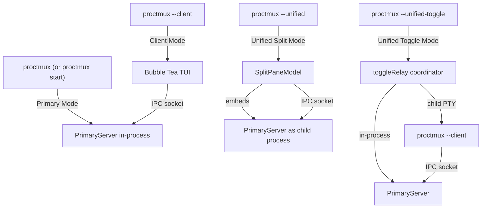

# Runtime Modes

proctmux has four runtime modes that control how the process server and TUI
interact. Every mode uses the same [IPC protocol](ipc.md) and
[configuration format](configuration.md); they differ in how the server runs,
how the UI renders, and how stdin/stdout are routed.



---

## 1. Primary Mode

**Invocation:** `proctmux` or `proctmux start`

The primary server is the headless process manager. It starts all configured
processes, exposes them over an IPC socket, and relays the selected process's
output to stdout.

### What happens

1. `main()` calls `RunPrimary()` (`cmd/proctmux/primary.go`).
2. `RunPrimary()` creates an `ipc.Server` and a `proctmux.NewPrimaryServer()`.
3. `ipc.CreateSocket()` generates a Unix domain socket at
   `/tmp/proctmux-<hash>.socket`, where `<hash>` is derived from the config
   file contents (`config.ToHash()`). See [Discovery](discovery.md) for details.
4. `primaryServer.Start(socketPath)` does the following:
   - Starts the IPC server on the socket.
   - Sets stdin to raw mode and starts a **stdin forwarder** goroutine that
     reads keystrokes and writes them to the currently selected process PTY.
   - Auto-starts any processes that have `autostart: true`.
5. A **viewer** (`internal/viewer`) relays the selected process's scrollback
   and live output to stdout.
6. The server blocks on `waitForShutdown()`, listening for `SIGINT` or
   `SIGTERM`.

### Shutdown

Ctrl+C (or SIGTERM) triggers `primaryServer.Stop()`, which:

- Restores the terminal from raw mode.
- Stops all running processes.
- Stops the IPC server (removes the socket file).

### When to use

- Running proctmux in a dedicated terminal pane or tmux window.
- Pairing with one or more `--client` instances for multi-terminal monitoring.
- Scripting via signal commands (`signal-start`, `signal-stop`, etc.) from
  other terminals or CI.

---

## 2. Client Mode

**Invocation:** `proctmux --client`

A Bubble Tea TUI that connects to an already-running primary server. It does
not manage processes directly; all actions are sent as IPC commands.

### What happens

1. `main()` calls `RunClient()` (`cmd/proctmux/client.go`).
2. The client discovers the socket automatically via `ipc.GetSocket()`, using
   the same config hash as the primary. If the `PROCTMUX_SOCKET` environment
   variable is set (used internally by unified-toggle mode), it connects
   directly without probing.
3. If the socket does not exist yet, the client waits up to 30 seconds with a
   progress indicator, polling every 100ms.
4. `ipc.NewClient(socketPath)` establishes the connection.
5. `tui.NewClientModel(client, &state)` creates the Bubble Tea model, which:
   - Shows the process list with status indicators.
   - Receives state broadcasts (process views with output) from the primary.
   - Sends commands (`start`, `stop`, `restart`, `switch`) over IPC.
6. On quit (`q` key), the client sends a `stop-running` command to the primary
   server to halt all processes before exiting.

### When to use

- Viewing and controlling processes from a separate terminal.
- Running multiple client instances against the same primary server.

---

## 3. Unified Split Mode

**Invocation:** `proctmux --unified` (or `--unified-left`, `--unified-right`,
`--unified-top`, `--unified-bottom`)

A single Bubble Tea program that combines the client TUI and an embedded
terminal running the primary server in a side-by-side (or stacked) split pane.

### What happens

1. `main()` calls `RunUnified()` (`cmd/proctmux/unified.go`).
2. A `charmbracelet/x/vt` emulator is created to host a virtual terminal
   with full ANSI color/style rendering.
3. The current `proctmux` executable is re-launched as a child process in
   primary mode (with `--mode primary`), running inside a real PTY
   (`creack/pty`). PTY output is piped to the emulator via `io.Copy`.
   The `unifiedChildArgs()` helper strips all unified/client flags from the
   original CLI args.
4. `ipc.WaitForSocket()` blocks until the child primary server creates its
   socket.
5. `ipc.NewClient()` connects to the embedded primary.
6. `tui.NewSplitPaneModel(clientModel, emu, ptmx, cmd, orientation)` creates
   the composite model (`internal/tui/split_model.go`).

### Layout orientations

| Flag | Constant | Process list position |
|------|----------|-----------------------|
| `--unified` or `--unified-left` | `SplitLeft` | Left of process output |
| `--unified-right` | `SplitRight` | Right of process output |
| `--unified-top` | `SplitTop` | Above process output |
| `--unified-bottom` | `SplitBottom` | Below process output |

### Focus switching

The split pane has two focusable panes: **Client** (process list/TUI) and
**Server** (embedded terminal output).

| Key | Action |
|-----|--------|
| `ctrl+left` | Focus client pane (hardcoded) |
| `ctrl+right` | Focus server pane (hardcoded) |
| `ctrl+w` | Toggle focus between panes (configurable via `keybinding.toggle_focus` in config) |

A status bar at the bottom shows which pane is focused, with bold text on the
active pane and faint text on the inactive pane.

### Client pane sizing

For horizontal splits (`left`/`right`), the client pane width auto-sizes based
on the longest process name plus padding (`clientWidthPadding = 6`), clamped
between `minClientWidth = 24` and `totalWidth - minTerminalWidth` (where
`minTerminalWidth = 32`). If process names are not yet known, a 55% fallback
ratio is used.

For vertical splits (`top`/`bottom`), the client pane takes 55% of the
available height, clamped between `minClientHeight = 8` and
`totalHeight - minTerminalHeight` (where `minTerminalHeight = 10`).

### When to use

- Single-terminal operation where you want to see both the process list and
  raw server output side by side.
- When you prefer a Bubble Tea-rendered view of process output (via the
  embedded terminal emulator).

---

## 4. Unified Toggle Mode

**Invocation:** `proctmux --unified-toggle`

A full-screen toggle between the client TUI and raw process output. Unlike
unified split mode, this runs the primary server in-process and spawns the
client as a child process in a real PTY.

### What happens

1. `main()` calls `RunUnifiedToggle()` (`cmd/proctmux/unified_toggle.go`).
2. A `PrimaryServer` is created in-process with special options:
   - `SkipStdinForwarder: true` -- the coordinator owns stdin, not the server.
   - `SkipViewer: true` -- the coordinator manages viewer switching to prevent
     process output from bleeding into the client pane.
3. `ipc.CreateSocket()` creates the socket; `primaryServer.Start()` begins
   serving.
4. `spawnClientPTY()` launches `proctmux --client -f <config>` in a real PTY
   via `creack/pty`. The `PROCTMUX_SOCKET` environment variable is set so the
   child connects directly without probing (avoids a race where the probe
   connection consumes the initial state message).
5. A 1 MB ring buffer (`buffer.RingBuffer`) captures all client PTY output so
   that switching back to the client pane can replay recent frames.
6. The coordinator puts the user's terminal into raw mode.
7. SIGWINCH (terminal resize) signals are forwarded to the client PTY.
8. `newToggleRelay()` creates the `toggleRelay` struct, which owns the main
   event loop.

### The toggle relay

`toggleRelay.run()` is a blocking select loop over two channels:

- **IPC state updates:** tracks the currently selected process ID so the viewer
  knows which process to show when switching to the process pane.
- **Raw stdin chunks:** the coordinator reads stdin byte-by-byte, intercepting
  `ctrl+w` (byte `0x17`) to toggle panes. All other bytes are forwarded to
  whichever pane is currently showing.

### Pane switching

| Showing | ctrl+w pressed | Result |
|---------|---------------|--------|
| Client pane | Toggle | Switch to process pane |
| Process pane | Toggle | Switch to client pane |

**Switching to client pane** (`switchToClientPane`):

1. Stops any existing client relay goroutine (waits for full exit).
2. Suspends the viewer by calling `SwitchToProcess(0)`.
3. Clears the screen (`ESC[2J ESC[H`).
4. Takes an atomic snapshot of the ring buffer and subscribes for live data.
5. Starts a relay goroutine that writes ring buffer data to stdout.
6. Sends a fake SIGWINCH to the client PTY to force a full re-render.

**Switching to process pane** (`switchToProcessPane`):

1. Stops the client relay goroutine (waits for full exit).
2. Clears the screen.
3. Calls `viewer.SwitchToProcess(procID)` to begin relaying the selected
   process's scrollback and live output to stdout.
4. If no process is selected, stays on the client pane.

### Stdin routing

| Active pane | Stdin destination |
|-------------|-------------------|
| Client | Writes to `clientPTY` (the child `--client` process) |
| Process | Writes to the active process's PTY via `process.Controller.GetWriter()` |

### When to use

- Single-terminal operation where you want full-screen views of both the
  process list and process output (no split).
- When raw PTY rendering fidelity matters (the client runs in a real PTY, not
  an emulator).

---

## Mode Comparison

| | Primary | Client | Unified Split | Unified Toggle |
|---|---------|--------|---------------|----------------|
| **Server** | In-process | External (connects via IPC) | Child process in PTY + vt emulator | In-process |
| **TUI** | None (stdout viewer only) | Bubble Tea (full TUI) | Bubble Tea (SplitPaneModel) | Bubble Tea child in real PTY |
| **Process output** | Viewer relays to stdout | Rendered in TUI via IPC state | Embedded terminal emulator pane | Viewer relays to stdout (process pane) |
| **Stdin routing** | Forwarder goroutine to active PTY | Bubble Tea handles input; commands via IPC | Bubble Tea routes to focused pane | Coordinator routes to active pane/PTY |
| **Focus switching** | N/A | N/A | `ctrl+left`/`ctrl+right`, `ctrl+w` toggle | `ctrl+w` toggle (hardcoded byte intercept) |
| **Terminals needed** | 1 (+ clients in other terminals) | 1 (requires running primary) | 1 | 1 |
| **Invocation** | `proctmux` | `proctmux --client` | `proctmux --unified[-left\|right\|top\|bottom]` | `proctmux --unified-toggle` |

---

## Choosing a Mode

**Single-terminal, simple setup:**
Use `proctmux --unified-toggle` for a full-screen toggle experience, or
`proctmux --unified` for a side-by-side split. Both are self-contained and
require no additional setup.

**Multi-terminal monitoring:**
Run `proctmux` (primary) in one terminal, then open `proctmux --client` in one
or more additional terminals. All clients share the same process state and can
send commands independently.

**IDE integration and scripting:**
Run the primary server, then use signal commands from scripts or IDE tasks:

```sh
proctmux signal-start my-server
proctmux signal-stop my-server
proctmux signal-list
proctmux signal-stop-running
```

These connect to the running primary via IPC, execute the command, and exit.
See [IPC](ipc.md) for protocol details and [Process Lifecycle](process-lifecycle.md)
for how processes are managed.
