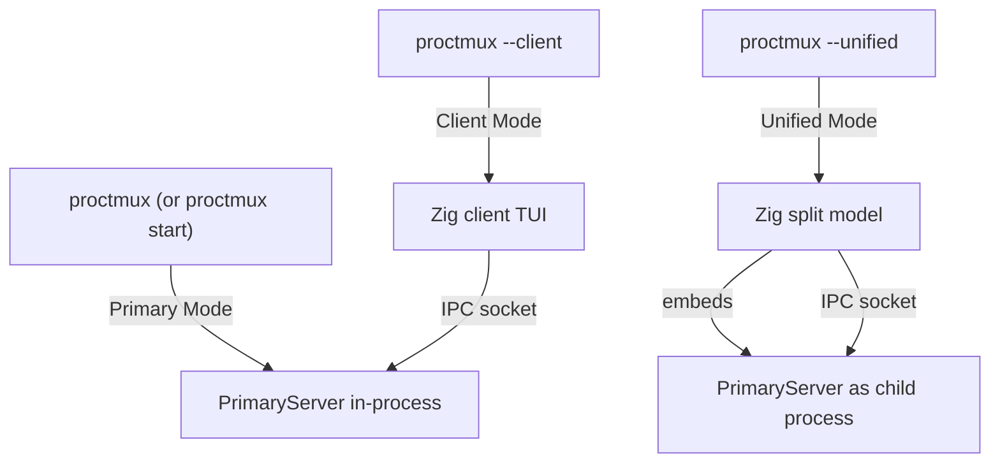

# Runtime Modes

proctmux has three runtime modes that control how the process server and TUI
interact. Every mode uses the same [IPC protocol](ipc.md) and
[configuration format](configuration.md); they differ in how the server runs,
how the UI renders, and how stdin/stdout are routed.

The shipped implementation is the Zig runtime under `src/`. The Go code remains
in-tree only as a parity reference.



---

## 1. Primary Mode

**Invocation:** `proctmux` or `proctmux start`

The primary server is the headless process manager. It starts all configured
processes, exposes them over an IPC socket, and relays the selected process's
output to stdout.

### What happens

1. `src/main.zig` routes through `src/app/` into `src/modes/primary.zig`.
2. The primary server creates an IPC command server and process controller.
3. The socket layer generates a Unix domain socket at
   `/tmp/proctmux-<hash>.socket`, where `<hash>` is derived from the config
   file contents (`config.ToHash()`). See [Discovery](discovery.md) for details.
4. Primary startup does the following:
   - Starts the IPC server on the socket.
   - Sets stdin to raw mode and starts a **stdin forwarder** goroutine that
     reads keystrokes and writes them to the currently selected process PTY.
   - Auto-starts any processes that have `autostart: true`.
5. The primary output loop relays the selected process's scrollback and live
   output to stdout.
6. The server runs until the app stop flag is set or the command server exits.

### Shutdown

Ctrl+C (or SIGTERM) triggers `primaryServer.Stop()`, which:

- Restores the terminal from raw mode.
- Stops all running processes.
- Stops the IPC server (removes the socket file).

### When to use

- Running proctmux in a dedicated terminal pane or tmux window.
- Pairing with one or more `--client` instances for multi-terminal monitoring.
- Scripting via signal commands (`signal-start`, `signal-stop`, etc.) from
  other terminals or CI.

---

## 2. Client Mode

**Invocation:** `proctmux --client`

A Zig TUI that connects to an already-running primary server. It does not
manage processes directly; all actions are sent as IPC commands.

### What happens

1. `src/main.zig` routes through `src/app/` into `src/modes/client.zig`.
2. The client discovers the socket automatically through `src/ipc/socket.zig`,
   using the same config hash as the primary.
3. If the socket does not exist yet, the client waits up to 30 seconds with a
   progress indicator, polling every 100ms.
4. The Zig IPC client establishes the connection and uses `ipc.line` plus the
   codec modules to read state and response lines.
5. The client session creates the process-list model, which:
   - Shows the process list with status indicators.
   - Receives state broadcasts (process views with output) from the primary.
   - Sends commands (`start`, `stop`, `restart`, `switch`) over IPC.
6. On quit (`q` key), the client sends a `stop-running` command to the primary
   server to halt all processes before exiting.

### When to use

- Viewing and controlling processes from a separate terminal.
- Running multiple client instances against the same primary server.

---

## 3. Unified Mode

**Invocation:** `proctmux --unified` (or `--unified-left`, `--unified-right`,
`--unified-top`, `--unified-bottom`)

A single Zig program that combines the client TUI and an embedded primary
server in a side-by-side (or stacked) split pane.

### What happens

1. `src/main.zig` routes through `src/app/` into `src/unified/runtime.zig`.
2. The current `proctmux` executable is re-launched as a child primary process
   in a PTY by `src/unified/child_primary.zig`. The unified child-argument
   helper strips unified/client flags from the original CLI args.
3. The parent waits until the child primary creates its socket, then connects
   with the same IPC client used by standalone client mode.
4. The shared unified runtime loop handles key input, IPC state polling,
   terminal resize, and rendering for both production and the in-process test
   adapter in `src/unified/in_process_primary.zig`.
5. `src/unified/render.zig` composes the process list and terminal-output panes.
   PTY output is captured, parsed by `src/terminal/text.zig`, and redrawn on a
   polling loop.

### Layout orientations

| Flag | Constant | Process list position |
|------|----------|-----------------------|
| `--unified` or `--unified-left` | `SplitLeft` | Left of process output |
| `--unified-right` | `SplitRight` | Right of process output |
| `--unified-top` | `SplitTop` | Above process output |
| `--unified-bottom` | `SplitBottom` | Below process output |

### Focus switching

The split pane has two focusable panes: **Client** (process list/TUI) and
**Server** (embedded terminal output).

| Key | Action |
|-----|--------|
| `ctrl+left` | Focus client pane (hardcoded) |
| `ctrl+right` | Focus server pane (hardcoded) |
| `ctrl+w` | Toggle focus between panes (configurable via `keybinding.toggle_focus` in config) |

A status bar at the bottom shows which pane is focused, with bold text on the
active pane and faint text on the inactive pane.

### Client pane sizing

For horizontal splits (`left`/`right`), the client pane width auto-sizes based
on the longest process name plus padding (`clientWidthPadding = 6`), clamped
between `minClientWidth = 24` and `totalWidth - minTerminalWidth` (where
`minTerminalWidth = 32`). If process names are not yet known, a 55% fallback
ratio is used.

For vertical splits (`top`/`bottom`), the client pane takes 55% of the
available height, clamped between `minClientHeight = 8` and
`totalHeight - minTerminalHeight` (where `minTerminalHeight = 10`).

### When to use

- Single-terminal operation where you want to see both the process list and
  raw server output side by side.
- When you prefer a split-pane view of process output and process controls.

---

## Mode Comparison

| | Primary | Client | Unified |
|---|---------|--------|---------|
| **Server** | In-process | External (connects via IPC) | Child process in PTY |
| **TUI** | None (stdout viewer only) | Zig client TUI | Zig split model |
| **Process output** | Viewer relays to stdout | Rendered in TUI via IPC state | Embedded terminal emulator pane |
| **Stdin routing** | Forwarder goroutine to active PTY | TUI handles input; commands via IPC | Split model routes to focused pane |
| **Focus switching** | N/A | N/A | `ctrl+left`/`ctrl+right`, `ctrl+w` toggle |
| **Terminals needed** | 1 (+ clients in other terminals) | 1 (requires running primary) | 1 |
| **Invocation** | `proctmux` | `proctmux --client` | `proctmux --unified[-left\|right\|top\|bottom]` |

---

## Choosing a Mode

**Single-terminal, simple setup:**
Use `proctmux --unified` for a side-by-side split. It is self-contained and
requires no additional setup. To hide the process list while viewing output,
add this to your config:

```yaml
layout:
  hide_process_list_when_unfocused: true
```

With this enabled, focusing the server pane hides the process list and lets
the output fill the screen; focusing the client pane restores it.

**Multi-terminal monitoring:**
Run `proctmux` (primary) in one terminal, then open `proctmux --client` in one
or more additional terminals. All clients share the same process state and can
send commands independently.

**IDE integration and scripting:**
Run the primary server, then use signal commands from scripts or IDE tasks:

```sh
proctmux signal-start my-server
proctmux signal-stop my-server
proctmux signal-list
proctmux signal-stop-running
```

These connect to the running primary via IPC, execute the command, and exit.
See [IPC](ipc.md) for protocol details and [Process Lifecycle](process-lifecycle.md)
for how processes are managed.
